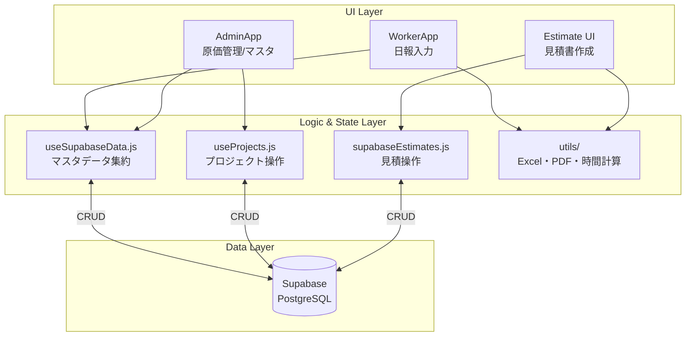

# 日報・原価管理システム アーキテクチャドキュメント

## 1. プロジェクト概要 (Project Overview)
本システムは、現場作業員からの日報入力、管理者側の原価管理・マスタ管理、見積書作成、スケジュール（工程表）管理を統合的に行うWebアプリケーションです。用途に応じて以下の3つの主要なアプリケーション（エントリーポイント）を持っています。
* **AdminApp**: 管理者向け（原価管理、プロジェクト・作業員マスタ管理、設定）
* **WorkerApp**: 現場作業員向け（日報・出退勤入力用）
* **ScheduleViewApp**: スケジュール（アサイン状況）閲覧専用

## 2. 技術スタック (Tech Stack)
* **フロントエンド**: React 18, Vite
* **スタイリング**: TailwindCSS, Vanilla CSS (`index.css`)
* **バックエンド / データベース**: Supabase (PostgreSQL)
* **帳票・ファイル出力**: `@react-pdf/renderer` (PDF見積書), `xlsx` (Excelインポート/エクスポート)
* **アイコン**: `lucide-react`
* **言語**: JavaScript (JSX) ※DB型定義（`database.types.ts` 等）を用いたデータ構造の意識をベースにしています。

## 3. フォルダ構成 (Folder Structure)
プロジェクト内の主要なディレクトリの役割は以下の通りです。

```text
src/
├── components/     # UIコンポーネント群
│   └── tabs/       # AdminAppなどの各画面タブ (InputTab, MasterTab, DashboardTab等)
├── hooks/          # 状態管理・Supabase通信用のカスタムフック (useSupabaseData, useProjects等)
├── lib/            # サードパーティライブラリの初期化 (supabase.js)
├── utils/          # ユーティリティ関数 (日付処理, Excel/PDF入出力, 労働時間計算ロジック等)
├── AdminApp.jsx    # 管理者用メインアプリケーション
├── WorkerApp.jsx   # 現場作業員用アプリケーション
├── ScheduleViewApp.jsx # スケジュール確認用アプリケーション
└── Estimate*.jsx   # 見積管理・PDF作成用コンポーネント (EstimateForm, EstimateList, EstimatePDF)
```

## 4. データフローと依存関係 (Data Flow & Dependencies)

### データの流れ (UI to Supabase)
1. **ユーザー操作**: UIコンポーネント（例: `WorkerApp`, `EstimateForm`）でデータ入力やボタン押下が行われます。
2. **カスタムフック / サービス**: コンポーネントは直接DBを操作せず、`hooks`層（`useSupabaseData` など）やサービス層（`supabaseEstimates.js`）の関数を呼び出します。
3. **Supabase Client**: `src/lib/supabase.js` で初期化されたクライアントを利用し、Supabase上の各テーブルに対してデータ取得・更新処理を行います。
4. **状態更新と再描画**: データのフェッチが完了後、Reactのローカルステート（`useState`）を更新し、UIに最新のデータが反映されます。

### アーキテクチャ全体図 (Architecture Diagram)


### クリティカルパス (Critical Paths)
システム改修時に特に影響が出やすい「クリティカルパス」は以下の通りです。

1. **日報スキーマ（`TaskRecords`）の変更**
   * **影響範囲**: `useSupabaseData.js`（データ取得と成形）、`WorkerApp.jsx`（入力フォームUI）、`DashboardTab.jsx`（原価集計・ダッシュボード表示）、`workTimeUtils.js`（労働・残業時間の計算ロジック）。
   * **注意点**: フィールドを追加・削除すると、各コンポーネントでのプロパティ参照エラーや集計ズレが発生しやすいため、一連の計算ロジックの追従が必須です。

2. **プロジェクトスキーマ（`Projects`）の変更**
   * **影響範囲**: `useProjects.js`、`AssignmentChartTab.jsx`（工程表の描画）、`MasterTab.jsx`。

3. **見積スキーマ（`estimates`, `estimate_items`）の変更**
   * **影響範囲**: `supabaseEstimates.js`（DB操作）、`EstimateForm.jsx`（入力UI）、`EstimatePDF.jsx`（PDF出力フォーマット）。

### 状態管理 (State Management)
* **ローカルステート（`useState` / `useEffect`）**: アプリケーション全体の状態管理は、主にReact標準のHooksで構成されています。
* **データの一元フェッチ**: `useSupabaseData.js` の `fetchAllData` メソッドにて、プロジェクト・作業員・レコード等のマスタデータを一括で取得・構造化し、親コンポーネントからPropsで各タブや子コンポーネントに分配する「中央集権型」のデータ管理を採用しています。

## 5. 設計ポリシーとコーディング規約 (Design Policies)

1. **Supabase呼び出しのフック化**
   * UIコンポーネント内に直接Supabaseの通信ロジックを書かず、必ず `src/hooks` 以下のカスタムフック、または専用のAPIファイル（`supabaseEstimates.js` など）に処理を委譲してください。

2. **ビジネスロジックの分離**
   * 給与計算、複雑な日付処理、PDF・Excelの出力生成といったUIに依存しないロジックは、必ず `src/utils` ディレクトリ内に配置し、テストしやすく再利用可能な形を維持してください。

3. **型定義の集約**
   * 「型定義は `database.types.ts` (あるいは `supabase_types.ts`) などの中央ファイルからインポートする」という原則に従い、DBスキーマとフロントエンドのデータ構造に乖離が生まれないよう意識してください。
