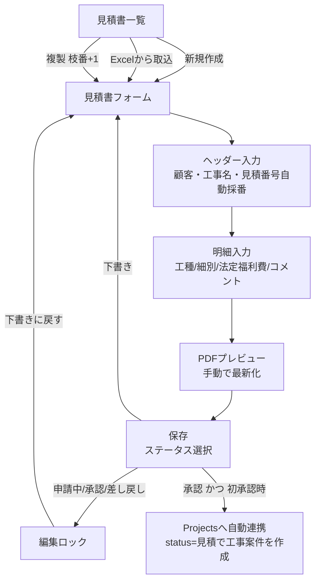

# 見積書作成 業務フロー改善提案

作成日: 2026-07-07
対象コード: `src/EstimateList.jsx` / `src/EstimateForm.jsx` / `src/supabaseEstimates.js` / `src/components/estimate/*`

---

## 1. 現状の業務フロー

- ステータス: `下書き(draft)` → `申請中(pending)` → `承認(approved)` / `差し戻し(returned)`
- 下書き以外は編集ロック。「下書きに戻す」で誰でも解除可能
- 承認時、同名+同顧客の工事案件が無ければ `Projects` に自動作成

---

## 2. 課題と改善提案

### 【優先度: 高】業務の抜け・データ損失リスク

#### 2-1. 承認フローが自己申告制で証跡が残らない
- **現状**: サイドバーのバッジをクリックすれば誰でも任意のステータスに変更できる。承認者・承認日時・差し戻し理由はどこにも記録されない。「下書きに戻す」も無制限。
- **問題**: 承認済み見積を無断修正→再承認しても履歴が残らず、提出済みPDFとDBの内容が食い違っても検知できない。
- **提案**:
  - `estimates` に `approved_by` / `approved_at` / `returned_reason` カラムを追加
  - 差し戻し時は理由入力を必須にする（モーダルで入力）
  - 将来的にはステータス変更履歴テーブル（`estimate_status_logs`）で監査証跡を残す

#### 2-2. 明細保存が「全削除→再挿入」でトランザクション無し
- **現状**: `saveEstimateItems()`（supabaseEstimates.js:162）は既存明細を DELETE した後に INSERT する2段階処理。
- **問題**: DELETE 成功後に INSERT が失敗（ネットワーク断・制約違反）すると**明細が全損**する。
- **提案**: Postgres 関数（RPC）化して1トランザクションで delete + insert を実行する。`get_next_estimate_seq` と同様に RPC を追加すればよい。

#### 2-3. 長時間の明細入力中にデータを失うリスク
- **現状**: 未保存変更は `beforeunload` の警告のみ。自動保存・下書き退避が無い。
- **問題**: 明細は最大300行。入力に30分かけた後のブラウザクラッシュ・誤操作で全損する。
- **提案**:
  - 第一段階: `localStorage` への自動退避（数秒間隔の debounce）＋復元プロンプト
  - 第二段階: 下書きステータスでの定期自動保存

#### 2-4. 承認→工事案件連携の失敗がユーザーに通知されない
- **現状**: EstimateForm.jsx:614 で連携失敗時は `console.error` のみ。ユーザーは連携されたと思い込む。
- **問題**: 工事案件が作られないまま施工が始まり、原価入力先が無い事態になる。
- **提案**: 失敗時に `showToast(..., 'error')` で通知（CLAUDE.md のエラー通知ルールにも準拠）。加えてこの処理は UI コンポーネント内で直接 `supabase.from()` を呼んでおり、「hooks 経由」の設計ルールに違反しているため `supabaseEstimates.js` へ移動する。

### 【優先度: 中】業務効率・受注管理

#### 2-5. 「承認」の先の受注管理が無い
- **現状**: ステータスは社内承認まで。顧客への**提出済 / 受注 / 失注**が管理できない。
- **問題**: 見積の歩留まり（受注率）や失注理由の分析ができず、営業活動の改善につながらない。
- **提案**: `ESTIMATE_STATUS` に `SUBMITTED(提出済)` / `ORDERED(受注)` / `LOST(失注)` を追加し、Projects への連携タイミングを「承認時」から「受注時」に変更する（現状は承認しただけで status=見積 の案件ができる）。

#### 2-6. 見積と工事案件が名前でしか紐づいていない
- **現状**: 承認時の連携は「工事名 + 顧客ID の一致」で重複判定。FK は無い。
- **問題**: 工事名を後から変更すると紐づけが切れる。見積金額と実行予算・原価の対比（粗利管理）がシステム上できない。
- **提案**: `Projects` に `estimate_id` カラムを追加して FK で紐づけ、原価管理タブで「見積金額 vs 実績原価」を表示できる土台を作る。

#### 2-7. 明細の再利用手段が Excel 取込と複製しかない
- **現状**: 類似工事でも明細は毎回手入力するか、見積全体を複製するしかない。単価もその都度入力。
- **提案**:
  - 過去見積から工種単位で明細をコピーする機能（「過去見積から取込」ボタン）
  - よく使う細別＋標準単価のマスタ化（入力時にインクリメンタルサーチで補完）

#### 2-8. 有効期限のフォローが無い
- **現状**: `valid_until` は空のまま保存可能。一覧に期限切れの表示も無い。
- **提案**: 発行日から自動で初期値を設定（例: +30日、`system_settings` で日数を設定可能に）し、一覧で期限切れ・期限間近をバッジ表示する。

### 【優先度: 低〜中】細かな品質改善

#### 2-9. 複製時の枝番重複チェック漏れ
- `duplicateEstimate()`（supabaseEstimates.js:125）は枝番を +1 するだけで重複チェックが無い。同じ見積を2回複製すると unique 制約違反で失敗する。Excel 取込側（EstimateList.jsx:156）にあるループ式の空き番号探索を共通化して使う。

#### 2-10. 見積番号採番の競合ウィンドウ
- 新規作成時に採番した番号は保存直前に重複チェックされるが、チェックと INSERT の間に他ユーザーが同番号で保存すると DB エラーになる。エラーメッセージが「保存に失敗しました」と汎用的なため、unique 制約違反時は「番号が使用済みです。再採番してください」と案内し、再採番ボタンを出す。

#### 2-11. Excel 取込時の顧客自動登録
- 取込時に一致する顧客が無いと**確認なしで新規顧客を登録**する（EstimateList.jsx:171）。表記ゆれ（「㈱」と「株式会社」等）で顧客マスタが重複していく。登録前に「新規顧客として登録しますか？ / 既存顧客に紐づけますか？」の確認ステップを挟む。

#### 2-12. PDFプレビューの手動「最新化」
- 入力変更がプレビューに自動反映されず「最新化」ボタンを押す運用。PDF生成コストを考慮した意図的な設計と思われるが、変更があった場合にツールバーへ「入力が変更されています」のインジケーターを出すだけでも押し忘れによる旧版確認を防げる。

---

## 3. 推奨する着手順

| 順 | 項目 | 理由 |
|----|------|------|
| 1 | 2-2 明細保存のトランザクション化 | データ全損リスクの解消。RPC追加のみで影響範囲が小さい |
| 2 | 2-4 連携失敗の通知＋hooks移動 | 修正が容易で、設計ルール違反の解消も兼ねる |
| 3 | 2-3 入力内容の自動退避 | 入力工数が大きい画面のため損失時の被害が大きい |
| 4 | 2-1 承認証跡（承認者・日時・差し戻し理由） | カラム追加＋UI小改修で監査性が大きく向上 |
| 5 | 2-5 / 2-6 受注ステータス＋FK連携 | 業務範囲の拡張。粗利管理の土台になるが設計判断が必要 |
| 6 | 2-7 明細マスタ・過去見積取込 | 効果は大きいが新規機能開発のため工数大 |

2-9〜2-12 は上記の改修に合わせて随時対応で十分。

---

## 4. 補足: 変更時に関係するファイル

| 改善項目 | 主な変更対象 |
|----------|--------------|
| 2-1, 2-5 | `utils/constants.js`, `EstimateSidebar.jsx`, `estimates` テーブル |
| 2-2 | `supabaseEstimates.js`, Supabase RPC（マイグレーション） |
| 2-3 | `EstimateForm.jsx` |
| 2-4, 2-6 | `EstimateForm.jsx` → `supabaseEstimates.js` へ処理移動, `Projects` テーブル |
| 2-7 | 新規コンポーネント, `estimate_items` またはマスタテーブル新設 |
| 2-8 | `EstimateHeader.jsx`, `EstimateList.jsx`, `system_settings` |
