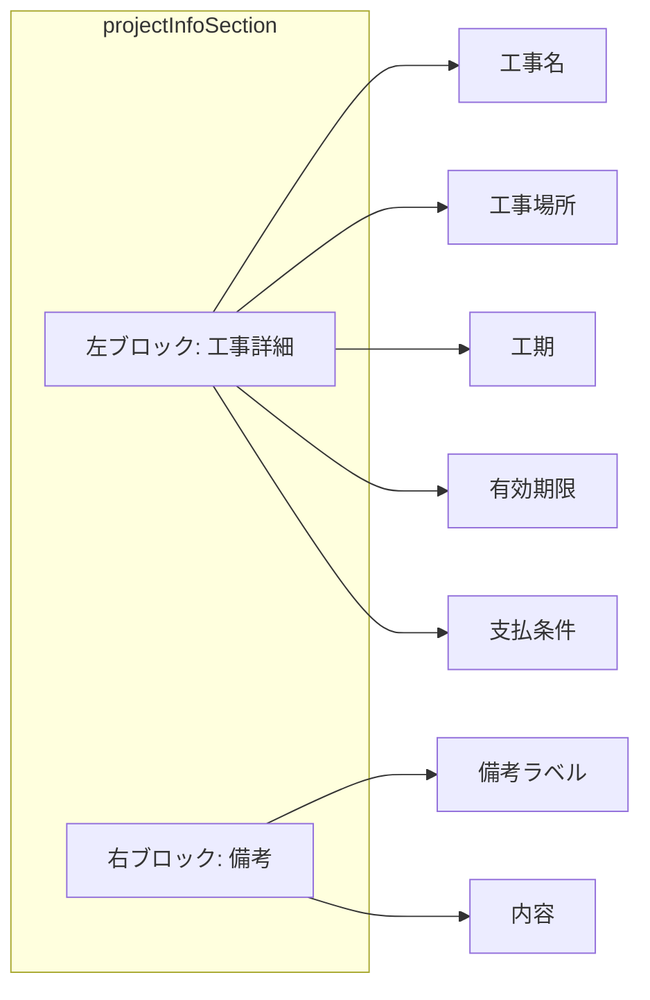

# 見積書表紙のレイアウト変更計画（左右ブロック化）

工事情報セクションを、左側の詳細情報と右側の備考に分割し、より整理された見た目に変更します。

## ユーザーレビューが必要な点

> [!IMPORTANT]
> 左右の比率について、現在は「左側を広く（flex: 1）、備考を固定幅（200pt）」にする構成を想定しています。備考が非常に長い場合は、右側の幅を広げるなどの調整が可能です。

## 提案する変更内容

### [Modify] [EstimatePDF.jsx](file:///c:/Users/katuy/Desktop/cost-management-app/src/EstimatePDF.jsx)

#### 1. スタイルの追加・修正
- `projectInfoSection`: `flexDirection: 'row'` を追加して横並びにします。
- `projectInfoLeft`: 左側ブロック用の新しいスタイル。
- `projectInfoRight`: 右側（備考）ブロック用の新しいスタイル（左に境界線を追加）。

#### 2. JSX構造の変更
`CoverPage` コンポーネント内の `projectInfoSection` を以下のように書き換えます。

- **左側**: 「工事名」「工事場所」「工期」「有効期限」「支払条件」を縦にリスト表示。
- **右側**: 「備考」ラベルと内容を表示。

---

## 修正後のイメージ（構造）

## 検証計画
- PDFを出力し、左右が綺麗に分かれているか確認する。
- 備考が長い場合や複数行になる場合の描画崩れがないか確認する。
