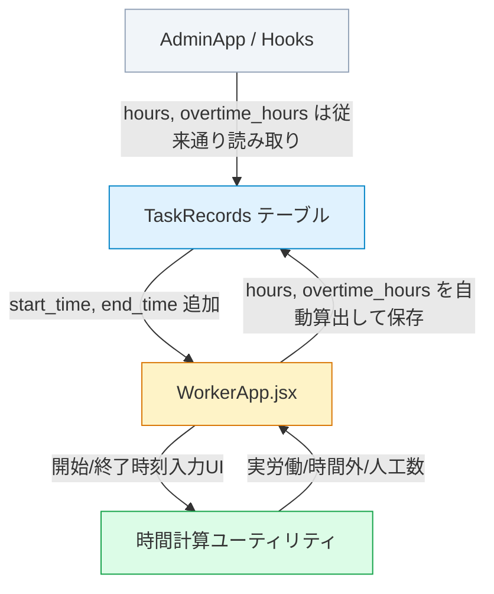

# 作業日報システム — 開始・終了時刻入力方式への変更

## 1. 背景

現在の作業日報システムは、各作業項目に対して「時間数」を直接入力（`[-]` `[数値]` `[+]`）する方式を採用している。  
これを「開始時刻・終了時刻」入力に変更し、休憩時間の自動控除・時間外労働の自動算出・人工数表示を実装する。

---

## 2. ユーザー確認事項

> [!IMPORTANT]
> ### 確認① — DBカラムの追加
> TaskRecords テーブルに `start_time` (time) と `end_time` (time) カラムを追加します。
> 既存の `hours` / `overtime_hours` カラムは**保持**し、開始・終了時刻から自動計算された値で書き込みます。
> これにより、管理画面（AdminApp）側の集計ロジックに一切変更を加えず後方互換を維持できます。
> → **よろしいでしょうか？**

> [!IMPORTANT]
> ### 確認② — 夏季/冬季の休憩時間は「作業時間帯と重なる分」だけ控除
> 例：作業時間が `13:00〜17:30` の場合、10:00-10:30の休憩は重ならないため控除しない。
> 15:00-15:30の休憩だけ控除し、実労働時間は `4時間` → `3.5時間` になる。
> → **この理解で正しいでしょうか？**

> [!WARNING]
> ### 確認③ — 同一作業項目に複数回の勤務は想定するか
> 例：ある作業項目で `8:00-12:00` と `13:00-17:30` のように、2回に分けて入力するケースはありますか？  
> 現在のDBの構造上、1作業員×1日×1作業項目 = 1レコードです。  
> 今回もこの前提（1作業項目に1セットの開始〜終了時刻）で進めてよいでしょうか？

> [!IMPORTANT]
> ### 確認④ — 時刻入力のステップ
> 仕様書に「任意（または15分/30分単位のステップ）」とありますが、**15分単位** で進めてよいでしょうか？

---

## 3. 変更概要

### 影響範囲マップ



---

## 4. 実装詳細

### Phase 1: DB スキーマ変更

#### [MODIFY] TaskRecords テーブル (Supabase SQL)

```sql
ALTER TABLE public."TaskRecords"
  ADD COLUMN start_time time,
  ADD COLUMN end_time time;
```

- `start_time` / `end_time` は `NULL` 許容（既存データとの互換のため）
- 既存レコードは `hours` / `overtime_hours` のみ保持しており、過去データの表示に問題なし

---

### Phase 2: ビジネスロジック（ユーティリティ関数）

#### [NEW] [workTimeUtils.js](file:///c:/Users/katuy/Desktop/cost-management-app/src/utils/workTimeUtils.js)

以下の関数を実装する：

**`getSeasonConfig(dateStr)`**  
日付文字列から夏季 (3〜10月) / 冬季 (11〜2月) を判定し、以下を返す：

| プロパティ | 夏季 (3-10月) | 冬季 (11-2月) |
|---|---|---|
| `scheduledStart` | `"08:00"` | `"08:00"` |
| `scheduledEnd` | `"17:30"` | `"17:00"` |
| `breaks` | `[{s:"10:00",e:"10:30"},{s:"12:00",e:"13:00"},{s:"15:00",e:"15:30"}]` | `[{s:"10:00",e:"10:15"},{s:"12:00",e:"13:00"},{s:"15:00",e:"15:15"}]` |
| `totalBreakMinutes` | `120` | `90` |
| `scheduledWorkHours` | `7.5` (= 9.5h - 2h) | `7.5` (= 9h - 1.5h) |

**`calculateWorkHours(startTime, endTime, dateStr)`**  
開始・終了時刻と日付から以下を算出：

1. **gross（粗作業時間）**: `endTime - startTime`（分単位）
2. **breakMinutes**: 作業時間帯と重複する休憩時間の合計
3. **netWorkHours（実労働時間）**: `(gross - breakMinutes) / 60`
4. **overtimeHours（時間外）**: 定時枠外の作業時間を算出  
   - 早出 = `max(0, scheduledStart - startTime)`
   - 残業 = `max(0, endTime - scheduledEnd)`
   - 早出・残業中の休憩重複は除外
5. **regularHours（定時内労働時間）**: `netWorkHours - overtimeHours`

**`calculateNinku(totalWorkHours, dateStr)`**  
- `totalWorkHours / scheduledWorkHours` で人工数を算出

---

### Phase 3: WorkerApp.jsx の改修

#### [MODIFY] [WorkerApp.jsx](file:///c:/Users/katuy/Desktop/cost-management-app/src/WorkerApp.jsx)

##### State 変更
- タスクの各レコードに `today_start_time` / `today_end_time` を追加
- `adjustHours` 関数を削除（不要になる）

##### データ読み込み（loadProjectDetails）
- TaskRecords から `start_time` / `end_time` も取得
- `mappedTasks` に `today_start_time` / `today_end_time` をマッピング

##### 時間算出（リアルタイム計算、useMemo）
- 各タスクに `start_time` / `end_time` が入力されたら `calculateWorkHours()` を呼び出し
- 結果を `today_hours` / `today_overtime_hours` としてリアルタイム表示
- ユーザーに hours フィールドの直接入力はさせない（自動計算を表示のみ）

##### 保存（handleSubmit）
- insert/update 時に `start_time` / `end_time` を追加保存
- `hours` / `overtime_hours` は計算結果を保存（AdminApp互換）

##### UI 変更

**作業項目カード（Before → After）：**

| Before (現在) | After (新) |
|---|---|
| `[-]` `[時間数]` `[+]` ボタン | `[開始時刻]` 〜 `[終了時刻]` タイムピッカー |
| `うち時間外稼働` 手動入力 | 実労働時間・時間外を自動表示バッジ |

タイムピッカーは `<input type="time">` を使用し、`step="900"` (15分刻み) を設定。

**フッター（送信ボタン）：**

```
[今日の実績を送信]
この現場: 7.5h (1.0人工) │ 本日合計: 12.0h
```

- 人工数は `calculateNinku(totalInputHours, selectedDate)` で算出

---

### Phase 4: AdminApp 側の互換性確認

#### 影響を受けないファイル（変更不要）
- `useSupabaseData.js` — `hours` / `overtime_hours` を読むロジックは変更不要
- `useDashboardStats.js` — hours ベースの集計は従来通り動作
- `useProjects.js` — addRecord / updateRecordField は hours ベース、変更不要
- `AdminApp.jsx` — TaskRecords の表示は hours のみ使用

> [!NOTE]
> AdminApp側の管理画面の日報入力タブ（InputTab）には **start_time / end_time は表示しない**。
> 管理者はこれまで通り hours の数値を見ることができます。
> 将来的に管理者画面でも時刻を表示したい場合は、別途対応します。

---

## 5. 画面イメージ

### 作業項目カード（新デザイン）

```
┌─────────────────────────────────┐
│ 外壁塗装 下塗り                    │
├─────────────────────────────────┤
│ 作業時間                          │
│ ┌─────────┐    ┌─────────┐      │
│ │  08:00  │ 〜 │  17:30  │      │
│ └─────────┘    └─────────┘      │
│                                   │
│ ┌─────────┐ ┌──────────────┐     │
│ │実働 7.5h│ │時間外 0.5h 🟠│     │
│ └─────────┘ └──────────────┘     │
│                                   │
│ メモ: _________________________  │
│                                   │
│ ── 職長のみ ──                    │
│ 現在の進捗率: ████████░░ 80%     │
└─────────────────────────────────┘
```

### フッター（送信ボタン）

```
┌─────────────────────────────────┐
│       [💾 今日の実績を送信]         │
│  この現場: 7.5h (1.0人工)          │
│  本日合計: 15.0h                   │
└─────────────────────────────────┘
```

---

## 6. 検証計画

### 自動テスト
- `workTimeUtils.js` の各関数について以下のケースをconsoleデバッグで確認：
  - 夏季フルタイム: 8:00-17:30 → 実働 7.5h, 時間外 0h
  - 冬季フルタイム: 8:00-17:00 → 実働 7.5h, 時間外 0h
  - 夏季早出残業: 7:00-19:00 → 実働 9.5h, 時間外 2.5h
  - 半日: 8:00-12:00 → 実働 3.5h (10:00-10:30 控除), 時間外 0h
  - 午後のみ: 13:00-17:30 → 実働 4.0h (15:00-15:30 控除), 時間外 0h

### 手動検証（ブラウザ確認）
- 開始・終了時刻を入力し、カード内の実労働/時間外表示がリアルタイム更新されること
- 送信後、管理画面の日報入力タブで hours / overtime_hours が正しく保存されていること
- 日付を3月→11月に変えた時、休憩/定時の切り替えが正しく動作すること
- 複数現場で入力し、本日合計が正しく表示されること

---

## 7. Open Questions

> [!IMPORTANT]
> 1. 上記確認①〜④について、ご判断をお聞かせください。 
> 2. 管理画面（AdminApp）の日報入力タブでも、今回の時刻入力方式に切り替えますか？それとも WorkerApp のみですか？
> 3. 既存の保存済みレコード（start_time が NULL のもの）を WorkerApp 上で開いたとき、hours の値から逆算して仮の時刻を表示しますか？それとも空欄にしますか？
